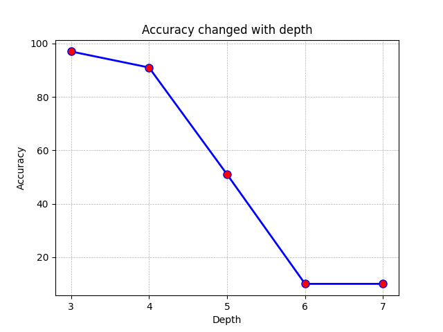
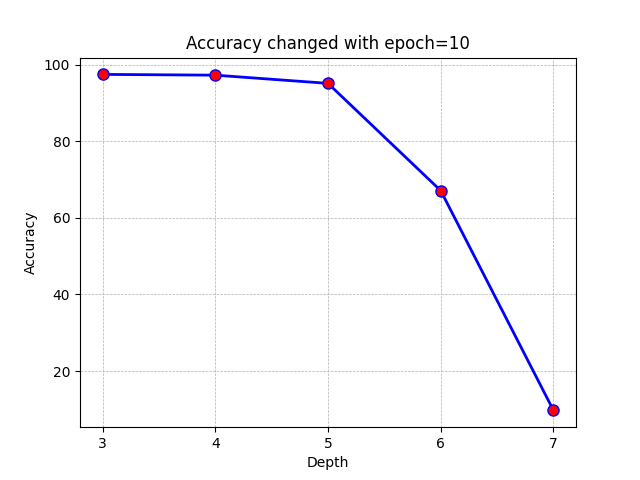
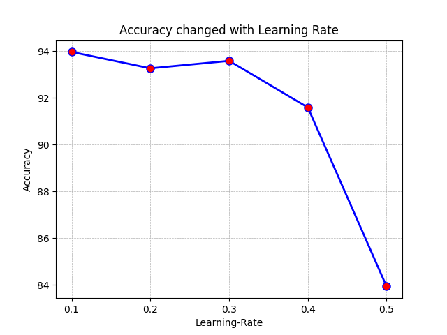
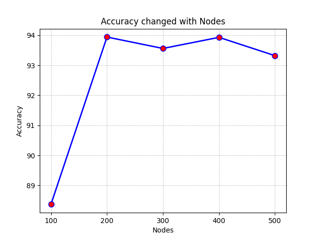

# 实验目标

本实验的目标是实现一个基本的多层神经网络，以支持简单的手写数字识别。

对于本实验提供了一个简单的三层神经网络，在两轮迭代的情况下可以达到97%的正确率。这是一个很高的水平。基于提供的代码，我将其修改为了**深度可配置**的神经网络，并进行了一系列的实验。

并且，在实验过程中，我进一步学习了神经网络的相关知识，加深了对齐数学原理的认识。

# 实验原理

## 神经元

神经网络是由具有适应性的**简单单元组成的广泛并行互连的网络**，它的组织能够模拟生物神经系统对真实世界物体所作出的交互反应。

M-P神经元模型：

- 神经元接收到来自其他n个神经元传递过来的输入信号

- 这些输入信号通过**带权重的连接**进行传递。

- 神经元接收到的**总输入值将与神经元的阀值**进行比较

- 然后通过**激活函数**（activation function）处理以产生神经元的输出

  - 理想的激活函数是阶跃函数，将输入值映射为$\{0,1\}$，1代表神经元兴奋，0代表神经元抑制

  - 实际中会使用Sigmoid函数进行代替，也称为挤压函数


事实上，从计算机科学的角度看，可以先不考虑神经网络是否真的模拟了生物神经网络，只需**将一个神经网络视为包含了许多参数的数学模型**，这个模型是若干个函数， 例如$y_j=f(\sum_iw_ix_i-\theta_j)$相互（嵌套）代入而得到。

## 反向传播

对于BP算法，将误差进行反向传播，基于梯度下降的原理调整神经元的计算权重，实现更好的拟合效果。

1. 先将输入示例提供给输入层神经元，逐层将信号前传，直到产生输出层的结果
2. 然后计算输出层的误差，再将误差**逆向传播至隐层神经元**
3. 最后根据隐层神经元的误差来对连接权和阈值进行调整
4. 该法代过程循环进行，直到达到某些停止条件为止，输出连接权与阈值确定的多层前馈神经网络

在数学上，由于采用的激励函数为$f(x) = \frac{1}{1 - e^{-x}}$，故有：
$$
f'(x) = f(x) (1 - f(x))
$$
进而在反向传播的梯度计算上，有：
$$
\begin{align*}

e_h &= - \frac{\part E_k}{\part b_h} \frac{\part b_h}{\part \alpha_h} \\

&= - \sum_{j = 1}^{l} \frac{\part E_k}{\part \beta_j} \frac{\part \beta_j}{\part b_h} f'(\alpha_h - \gamma_h) \\

&= b_h(1 - b_h) \sum_{j = 1}^{l} w_{hj} g_j

\end{align*}
$$

# 实验实现

在确定实验思路后，进行了相关代码的书写，实现了一个可配置层数的神经网络。

## 神经网络结构调整

在`model.py`文件中，将原先的单层隐藏层修改为了可配置深度的隐藏层。

为了进行简化，假定了每个隐藏层的神经元个数相同。

具体方式为：

1. 修改隐藏层为一个列表`hidden_outputs_list`，其中储存了隐藏层相关的输出信息
2. 将隐藏层的权重信息修改为列表形式的`whh_list`，其中的`whh_list[i]`表示第`i`个隐藏层和第`i+1`个隐藏层之间的权重信息。其初始值均在网络初始化时进行随机初始化。

## 前向传播

前向传播的思路与原先类似。通过循环的方式实现了对隐藏层的逐层计算，达成了整体的前向传播。

在数学上的方式为

```py
# 计算输入层
self.inputs = np.array(input_feature, ndmin=2).T

# 计算相邻的隐藏层
hidden_inputs = np.dot(self.wih, self.inputs)
for i in range(self.hidden_depth):
    self.hidden_outputs_list[i] = self.activation_function(hidden_inputs)
    hidden_inputs = np.dot(self.whh_list[i - 1], self.hidden_outputs_list[i])

# 计算输出层
final_inputs = np.dot(self.who, self.hidden_outputs_list[self.hidden_depth - 1])
self.final_outputs = self.activation_function(final_inputs)
```

## 反向传播

反向传播需要修改代码的两个部分：

1. 实现对每一层的误差计算
2. 在计算误差后，需要遍历所有的隐藏层，计算相应的梯度，进行反向传播

为了进行一定的简化，之前假定了各隐藏层的神经元个数相同，因此每一层的计算形式是相同的，只需要通过循环遍历每一个隐藏层即可：

```py
# hidden layer error
hidden_error = [None for _ in range(self.hidden_depth)]
hidden_delta = [None for _ in range(self.hidden_depth)]

# calculate hidden layer error and delta
for i in reversed(range(self.hidden_depth)):
    if i == self.hidden_depth - 1:
        hidden_error[i] = np.dot(self.who.T, output_delta)
        hidden_delta[i] = hidden_error[i] * self.hidden_outputs_list[i] * (1.0 - self.hidden_outputs_list[i])
    else:
        hidden_error[i] = np.dot(self.whh_list[i - 1].T, hidden_delta[i + 1])
        hidden_delta[i] = hidden_error[i] * self.hidden_outputs_list[i] * (1.0 - self.hidden_outputs_list[i])
```

# 实验结果与分析

在实现了**可配置层数**的多层神经网络后，对实验相关的神经网络层数、学习率、中间节点数、迭代轮数都进行了相关的实验。

## 实验结果

其中实验结果为：

| 层数 | 学习率 | 中间节点数 | 迭代轮数 | 准确率 |
| ---- | ------ | ---------- | -------- | ------ |
| 3    | 0.1    | 200        | 2        | 97     |
| 4    | 0.1    | 200        | 2        | 91     |
| 5    | 0.1    | 200        | 2        | 51     |
| 6    | 0.1    | 200        | 2        | 10     |
| 7    | 0.1    | 200        | 2        | 10     |
| 102  | 0.1    | 200        | 2        | 10     |
| 3    | 0.1    | 200        | 10       | 97.42  |
| 4    | 0.1    | 200        | 10       | 97.22  |
| 5    | 0.1    | 200        | 10       | 95.08  |
| 6    | 0.1    | 200        | 10       | 67.09  |
| 7    | 0.1    | 200        | 10       | 9.74   |
| 4    | 0.1    | 200        | 2        | 93.96  |
| 4    | 0.2    | 200        | 2        | 93.26  |
| 4    | 0.3    | 200        | 2        | 93.58  |
| 4    | 0.4    | 200        | 2        | 91.59  |
| 4    | 0.5    | 200        | 2        | 83.94  |
| 4    | 0.1    | 100        | 2        | 88.37  |
| 4    | 0.1    | 200        | 2        | 93.94  |
| 4    | 0.1    | 300        | 2        | 93.56  |
| 4    | 0.1    | 400        | 2        | 93.93  |
| 4    | 0.1    | 500        | 2        | 93.32  |

## 实验结果分析

### 神经网络深度

首先，在其他参数与baseline保持相同的情况下，调整了神经网络的层数，从实验结果中可以看出，当层数为3、4、5时，依然具有较好的识别效果，但是当层数为6时，识别率急速下降，识别率仅有0.118，显著小于其他参数设置下的0.9以上的识别率。

| 层数 | 学习率 | 中间节点数 | 迭代轮数 | 准确率 | 备注     |
| ---- | ------ | ---------- | -------- | ------ | -------- |
| 3    | 0.1    | 200        | 2        | 97     | baseline |
| 4    | 0.1    | 200        | 2        | 91     |          |
| 5    | 0.1    | 200        | 2        | 51     |          |
| 6    | 0.1    | 200        | 2        | 10     |          |
| 7    | 0.1    | 200        | 2        | 10     |          |
| 102  | 0.1    | 200        | 2        | 10     |          |

对此总结为：当迭代轮数较少而神经网络较深时，可以看到神经网络的分类效果极低，没有达到训练效果。



通过对神经网络的分析，推测其可能的原因是为当轮数较少时，相关权重依然处于一个较为随机的状态，反向传播的调整并没有起到很好的作用。整体网络依然以一种近乎于初始随机状态的效果进行运行。

同时，还训练了一个100层的神经网络，在epoch=2和epoch=200的情况下训练效果均较差。限于本次实验要求不使用框架，未使用`pytorch`进行进一步的尝试。

### 训练迭代轮数

为了上述猜想，在其他参数保持不变的情况下，将实验的迭代轮数调整为了10，观察此次的训练效果，发现有了较为显著的提升。

| 层数 | 学习率 | 中间节点数 | 迭代轮数 | 准确率 |
| ---- | ------ | ---------- | -------- | ------ |
| 3    | 0.1    | 200        | 10       | 97.42  |
| 4    | 0.1    | 200        | 10       | 97.22  |
| 5    | 0.1    | 200        | 10       | 95.08  |
| 6    | 0.1    | 200        | 10       | 67.09  |
| 7    | 0.1    | 200        | 10       | 9.74   |

对此，可以进行一定的总结：当神经网络深度较深时，训练轮数较少会使得神经网络没有较好的效果，反而不如深度较低的情况。



### 改变学习率

在相较于baseline其他情况不变的情况下，修改了不同的学习率，实验结果为：

| 层数 | 学习率 | 中间节点数 | 迭代轮数 | 准确率 |
| ---- | ------ | ---------- | -------- | ------ |
| 4    | 0.1    | 200        | 2        | 93.96  |
| 4    | 0.2    | 200        | 2        | 93.26  |
| 4    | 0.3    | 200        | 2        | 93.58  |
| 4    | 0.4    | 200        | 2        | 91.59  |
| 4    | 0.5    | 200        | 2        | 83.94  |

发现学习率也会对实验造成一定的影响。



### 改变中间节点数目

在相较于baseline其他情况不变的情况下，修改了不同的隐藏层节点数，实验结果为：

| 层数 | 学习率 | 中间节点数 | 迭代轮数 | 准确率 | 备注 |
| ---- | ------ | ---------- | -------- | ------ | ---- |
| 4    | 0.1    | 100        | 2        | 88.37  |      |
| 4    | 0.1    | 200        | 2        | 93.94  |      |
| 4    | 0.1    | 300        | 2        | 93.56  |      |
| 4    | 0.1    | 400        | 2        | 93.93  |      |
| 4    | 0.1    | 500        | 2        | 93.32  |      |

发现中间节点数目也会对实验造成一定的影响。



# 实验总结

在本次实验中，完成了对简单DNN的修改，进行了各种参数的修改，观察了不同的训练效果。

在本次实验中，我加深了对反向传播的理解。