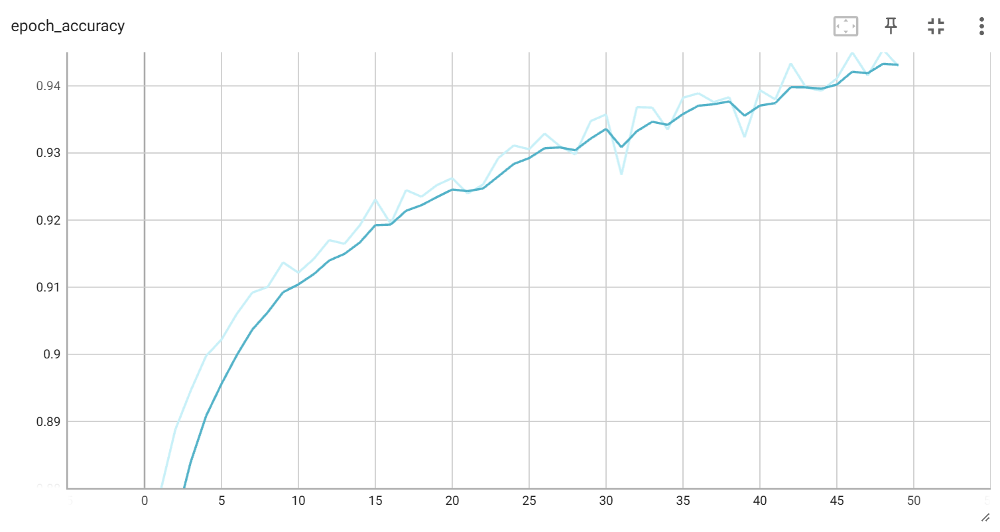
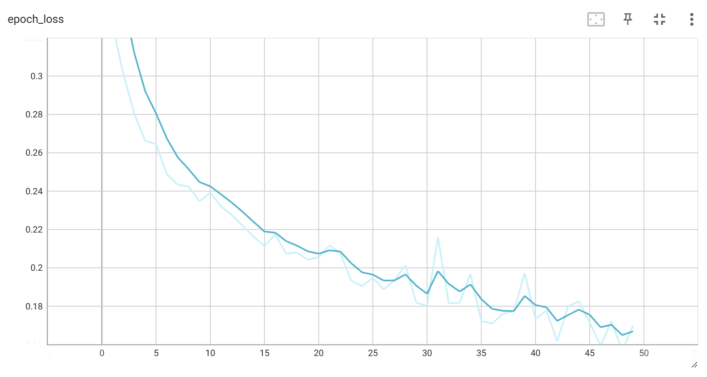
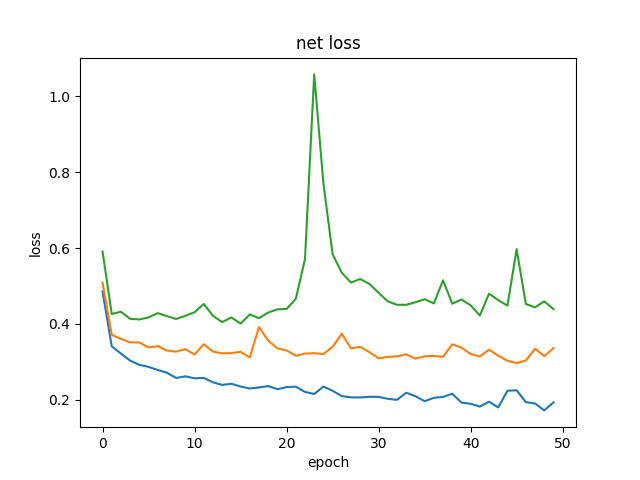
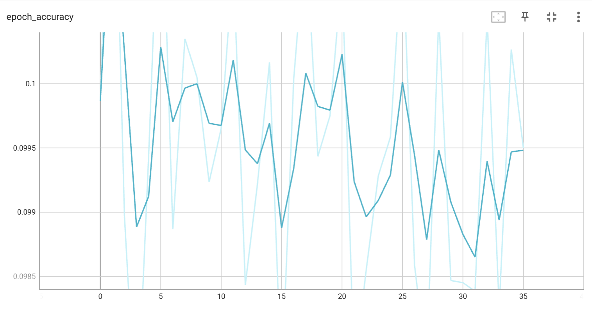

# 实验说明

由于本次实验框架提供的代码为`tensorflow1.15`版本，所支持的最高CUDA版本为`CUDA10.0`，而我的电脑上的CUDA版本为`CUDA11.8`。

相较于折腾CUDA和重写实验代码，显然使用·`tensorflow2.x`版本重写一遍实验是一种更为方便的方法，并且不会有折腾坏CUDA的风险。

本次实验最终**没有采用提供的模板代码**，而是使用了`tensorflow2.13`版本进行书写。

# 实验目标

搭建深度神经网络，实现一个`LeNet`，来完成在`MINIST`数据集上的数字识别任务。

相较于`1.x`版本，`2.x`版本的`tensorflow`提供了较好层次的抽象，使得在代码书写上较为简易。

# 实验原理

## CNN

CNN：卷积神经网络

卷积神经网络依旧是层级网络，只是层的功能和形式做了变化，可能会多原有层级网络没有的部分

### 层级结构

一个卷积神经网络主要由以下5层组成：

- 数据输入层：Input layer
- 卷积计算层：CONV layer
- ReLU激励层：ReLU layer
- 池化层：Pooling layer
- 全连接层：FC layer

#### 数据输入层

该层要做的处理主要是对原始图像数据进行预处理，其中包括：

- 去均值：把输入数据各个维度都中心化为0，其目的就是把样本的中心拉回到坐标系原点上。
- 归一化：幅度归一化到同样的范围，即减少**各维度数据取值范围的差异**而带来的干扰
- PCA/白化：用PCA降维；白化是对数据**各个特征轴上的幅度归一化**

#### 卷积计算层CONV

在这个卷积层，有两个关键操作：

- 局部关联。每个神经元看做一个滤波器（filter）
- 窗口（receptive field）滑动， filter对局部数据计算

卷积计算的名词：

- 深度/depth：数据的层数
- 步幅/stride：窗口一次滑动的长度
- 填充值/zero-padding

## LeNet

Lenet是一系列网络的合称，包括Lenet1-Lenet5，是卷积神经网络的开山之作，也是将深度学习推向繁荣的一座里程碑。

LeNet首次采用了卷积层、池化层这两个全新的神经网络组件，接收灰度图像，并输出其中包含的手写数字，在手写字符识别任务上取得了瞩目的准确率。LeNet网络的一系列的版本，以LeNet-5版本最为著名，也是LeNet系列中效果最佳的版本。

# 实验实现

参照提供的模板代码，以类似的文件逻辑结构书写了相关的网络代码。

## 网络定义

在`tf_network.py`中实现了对网络的定义

```py
self.net = keras.Sequential([
    # layer1
    Conv2D(self.filters, kernel_size=self.kernel_size),
    MaxPooling2D(pool_size=2, strides=2),
    ReLU(),

    # layer2
    Conv2D(16, kernel_size=self.kernel_size),
    MaxPooling2D(pool_size=2, strides=2),
    ReLU(),

    # layer3
    Conv2D(120, kernel_size=self.kernel_size),
    ReLU(),
    Flatten(),

    # fc1
    Dense(84, activation='relu'),

    # fc2
    Dense(10, activation='softmax')
])
```

## 不同层的定义

- **layer1**:
    - `Conv2D(self.filters, kernel_size=self.kernel_size)`：二维卷积层，用于提取输入数据的特征。
        - `self.filters` 指定了卷积核的数量
        - `kernel_size=self.kernel_size` 指定了卷积核的大小
    - `MaxPooling2D(pool_size=2, strides=2)`：最大池化层，用于降低特征图的空间维度（高和宽），同时保留最重要的信息
        - `pool_size=2` 表示池化窗口的大小为 2x2
        - `strides=2` 表示池化窗口移动的步长为 2
    - `ReLU()`：这是一个激活层，使用 ReLU（Rectified Linear Unit）激活函数来引入非线性
        - ReLU 函数的公式是 `f(x) = max(0, x)`
- **layer2**:
    - `Conv2D(16, kernel_size=self.kernel_size)`：二维卷积层
        - 这次卷积核的数量是16
        - 经过这一层，6 张`14 x 14`的feature map变成了16张`14 x 14`的feature map
    - `MaxPooling2D(pool_size=2, strides=2)`：最大池化层，与 layer1 中的相同
    - `ReLU()`：另一个 ReLU 激活层
- **layer3**:
    - `Conv2D(120, kernel_size=self.kernel_size)`：第三个二维卷积层，卷积核的数量是 120
    - `ReLU()`：这是第三个 ReLU 激活层
    - `Flatten()`：这是一个展平层，用于将多维的特征图转换为一维向量
        - 这对于将卷积层的输出传递给全连接层是必要的。
- **fc1**:
    - `Dense(84, activation='relu')`：全连接层
        - 有 84 个神经元，使用 ReLU 激活函数。
- **fc2**:
    - `Dense(10, activation='softmax')`：全连接层
        - 使用 `softmax` 激活函数可以将输出转换为概率分布

## 数据来源

使用了`tensorflow`中内置的MINST数据集，在`tf_data.py`中实现了对数据的解析

### 数据填充

使用填充函数对图像进行了填充，将尺寸由`28*28`填充为了`32*32`，在不足处填补0

```py
# padding 28*28 to 32*32
paddings = tf.constant([[0, 0], [2, 2], [2, 2]])
x_train = tf.pad(x_train, paddings)
x_test = tf.pad(x_test, paddings)
```

### 独热码转换

1. 将输入的特征数据转换为浮点型，并将其值归一化到0到1之间：原始的MNIST数据集中的图像像素值范围是0到255，归一化可以帮助模型更好地学习
2. 将特征数据重塑为`[-1, 32, 32, 1]`的形状，其中`-1`表示自动计算该维度的大小，以确保数据的总元素数量不变
3. 对标签数据进行one-hot编码。将整数类型的标签转换为长度为10的向量，其中只有一个元素为1，其余元素为0。目的是为了让模型能够处理分类问题

```py
def _dense_to_one_hot(x, y):
    x = tf.cast(x, dtype=tf.float32) / 255.
    x = tf.reshape(x, [-1, 32, 32, 1])
    y = tf.one_hot(y, depth=10)  # one_hot 编码
    return x, y
```

## 训练流程

对网络的建立、训练、测试保存均进行了封装，直接运行`tf_minst.py`文件即可

```py
train_db, test_db = get_train_test_data()

net = LeNet(input_shape=(batch_size, 32, 32, 1))
net.summary()

# train
history = net.train(train_db,
                    epoch=epoch,
                    lr=lr,
                    batch_size=batch_size,
                    log_dir=log_dir)
# test
net.test(test_db)

# save
net.save()
```

# 实验结果与分析

## 默认实验配置

对于基本的参数设置（`lr=0.01`），测试准确率为0.88

准确率变化：



loss变化：



## 调参分析

分别改变了学习率和最后一层的激活函数。

### 学习率lr

对于不同学习率，记录了参数：

| lr   | accuracy |
|------|----------|
| 0.01 | 0.88670  |
| 0.02 | 0.88584  |
| 0.03 | 0.84134  |
| 0.04 | 0.10029  |
| 0.05 | 0.09327  |

并且注意到，在训练过程中也会出现类似的波动：



在lr增大时尤为明显：



### 激活函数

对于不同的激活函数，有：

| activation | accuracy |
|------------|----------|
| softmax    | 0.88670  |
| sigmoid    | 0.88200  |
| relu       | 0.10000  |
| tanh       | 0.10000  |

可以看出，激活函数对整体效果也有较大影响。

# 实验总结

使用`tensorflow`完成了一个`LeNet`，对于深度学习框架有了一定的了解，巩固了对CNN的认识。