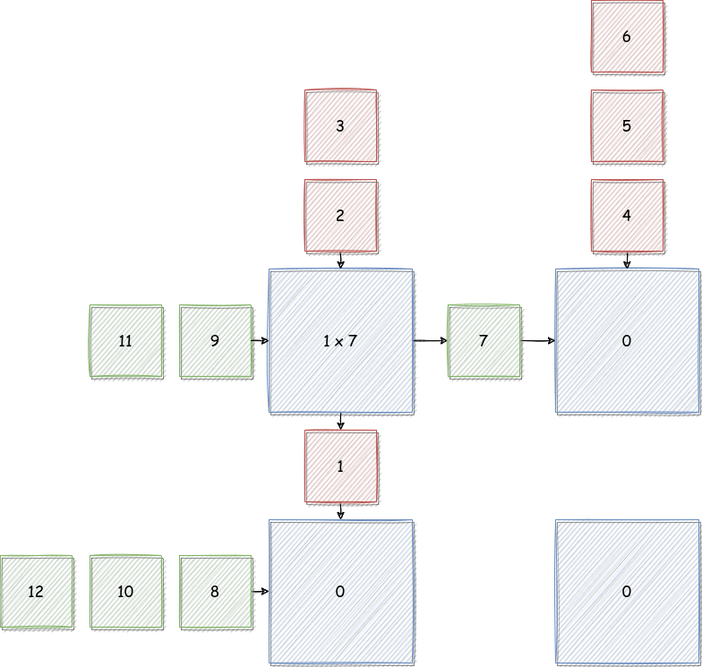
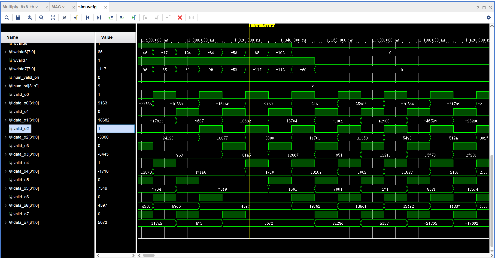
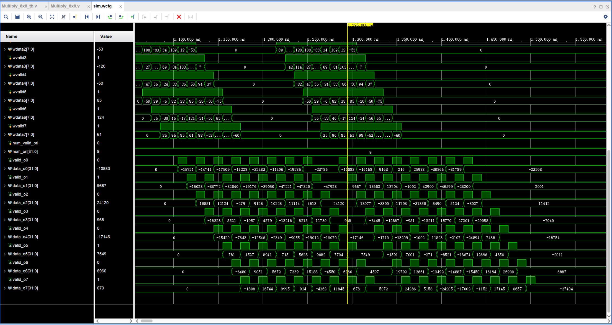

# 实验说明

本次实验为使用`Verilog`编写一个矩阵乘法器，事项一个Feature矩阵和Weight矩阵相乘的效果。

由于提供的代码过于丑陋，进行了重构，使得代码的可读性、美观性均达到了极大的提升。

# 实验目标

- 学习矩阵乘法器的原理
- 进行Linux向开发板的移植

# 实验原理

## 矩阵乘法

对于两个矩阵$A = A_{m \times n}, B = B_{n \times l}$，其相乘结果$C = A \times B$，有：
$$
C = (c_{ij})_{m \times l} \\
c_{ij} = \sum_{p=0}^{n} \sum_{q = 0}^{n} a_{ip} \times b_{pj}
$$
对于C中的元素$c_{ij}$，可以看作A的第i行与B的第j列进行流动，当元素相遇时，相乘后累加在$c_{ij}$上

并且，由于矩阵乘是对C的所有单元而言，故让A的所有行与B的所有列进行“流动”，最后即可在每个单元上积累得到所需的矩阵乘结果

这里借用一下博客中的图片：



## Verilog实现

在Verilog中，可以支持$8 * \text{num}$的Feature矩阵和$\text{num} * 8$的Weight矩阵相乘，实现最后的输出。

在这里，Feature矩阵是横向输入的，Weight矩阵是纵向输入的，由基本单元MAC映射结果矩阵的每个元素，进行计算。

### 外部接口

使用MAC作为基本单元，为了减少电路的旁路，MAC使用了大量的数据在MAC中进行串行传递

在计算过程中，会有如下数据的传递：

- 矩阵大小参数num：整个计算单元仅有唯一的输入，输入到位于$(0, 0)$位置的MAC，接下来，位于第一列的MAC进行从上到下的传递，每一行进行从左到右的传递
- w矩阵的数据：为纵向传递，第一行的MAC接收外部输入
- f矩阵的数据：为横向传递，第一列的MAC接收外部输入
- 结果输出：纵向传递，先传输的为行号高的数据

### 计算单元MAC

MAC的作用有两个：

1. 计算乘加操作，当w和f数据均为valid时，进行乘，并累加到自身的寄存器上，累加次数为num，实现了矩阵乘法操作
2. 数据传递：满足需要传递数据时，自身数据已经先行传递出去了，故不会造成数据冲突

# 实验实现

## 问题1

问题在于乘法的符号扩展问题：如果`f_data`的符号扩展类型为无符号，则乘法结果也是无符号的。

第一组矩阵乘的Feature矩阵均为正数，故不会造成影响；而第二组矩阵乘的Feature中元素有负数，故乘法过程中会造成错误，负数按照无符号类型进行扩展，造成了结果的错误。

故需要进行如下的修改：

```diff
- assign f_data_extend = $signed(8'b0, f_data});
+ assign f_data_extend = $signed({{8{f_data[7]}}, f_data});
```

修改后，可以得到正确的波形：



## 问题2

### MAC的接口与功能定义

MAC的接口定义为：

| 信号名      | 位宽 | 方向 | 含义                                       |
| ----------- | ---- | ---- | ------------------------------------------ |
| num_valid   | 1    | I    | 握手信号：矩阵参数num是否有效              |
| num         | 32   | I    | 矩阵参数num                                |
| num_valid_r | 1    | O    | 上一拍的握手信号：用于传递给其他MAC        |
| num_r       | 32   | O    | 上一拍的矩阵参数num：用于传递给其他MAC     |
| w_valid     | 1    | I    | 握手信号：传入的w_data是否有效             |
| w_data      | 8    | I    | weight矩阵数据                             |
| w_valid_r   | 1    | O    | 上一拍的握手信号：用于传递给其他MAC        |
| w_data_r    | 8    | O    | 上一拍的weight矩阵数据：用于传递给其他MAC  |
| f_valid     | 1    | I    | 握手信号：传入的f_data是否有效             |
| f_data      | 8    | I    | feature矩阵数据                            |
| f_valid_r   | 1    | O    | 上一拍的握手信号：用于传递给其他MAC        |
| f_data_r    | 8    | O    | 上一拍的feature矩阵数据：用于传递给其他MAC |
| valid_l     | 1    | I    | 握手信号：下一个（下方）MAC的数据是否有效  |
| data_l      | 8    | I    | 下一个（下方）MAC的数据                    |
| valid_o     | 1    | O    | 当前MAC运算结果是否有效                    |
| data_o      | 8    | O    | MAC的输出数据                              |

MAC的数据流向是确定的：

- 矩阵大小参数num：整个计算单元仅有唯一的输入，输入到位于$(0, 0)$位置的MAC，接下来，位于第一列的MAC进行从上到下的传递，每一行进行从左到右的传递
- w矩阵的数据：为纵向传递，第一行的MAC接收外部输入
- f矩阵的数据：为横向传递，第一列的MAC接收外部输入
- 结果输出：纵向传递，先传输的为行号高的数据

故输出数据的选择其实是确定的：当下方MAC数据有效时，自身的数据一定已经传输出去了，故可以进行选择下方传入的数据

至于为什么不再设置一个传输数据输出的端口，合理的猜测是为了节省不必要的电路资源消耗

### Multipy的接口和定义

事实上Multipy过于糟糕的写法造成了极低的可读性，进行重构后可以明白其清晰的逻辑：

1. 计算的过程是通过数据传递实现的，当数据进行输入时，也就同时开始计算，传输完成时数据也就完成了计算
2. 当数据完成计算后，开始进行数据的输出

Multipy的接口定义：

| 信号名        | 位宽 | 方向 | 含义                                    |
| ------------- | ---- | ---- | --------------------------------------- |
| clk           | 1    | I    | 时钟信号                                |
| rst           | 1    | I    | 异步复位信号，高电平有效                |
| fvalid        | 1    | I    | 握手信号：输入的feature矩阵数据是否有效 |
| fdata         | 8    | I    | 输入的feature矩阵数据                   |
| wvalid        | 1    | I    | 握手信号：输入的weight矩阵数据是否有效  |
| wdata         | 8    | I    | 输入的weight矩阵数据                    |
| num_valid_ori | 1    | I    | 握手信号：输入的num数据是否有效         |
| num_ori       | 32   | I    | 矩阵参数num                             |
| valid_o       | 1    | O    | 握手信号：矩阵输出数据是否有效          |
| data_o        | 32   | O    | 矩阵输出数据                            |

比如num的传递逻辑，为第一列进行从上至下的传递，第一列的元素再从左向右进行传递，故代码为：

```verilog
generate
    for(i = 0; i < 8; i = i + 1) begin
        for(j = 0; j < 8; j = j + 1) begin
            if(j == 0) begin
                // (0, 0)MAC为输入
                if(i == 0) begin
                    assign num_valid[8 * i + j] = num_valid_ori;
                    assign num[8 * i + j]       = num_ori;
                end
                // 每行第一个接受上方传入
                else begin
                    assign num_valid[8 * i + j] = num_valid_r[8 * (i - 1) + j];
                    assign num[8 * i + j]       = num_r[8 * (i - 1) + j];
                end
            end
            // 一般的MAC由左边的单元进行传递
            else begin
                assign num_valid[8 * i + j]     = num_valid_r[8 * i + j - 1];
                assign num[8 * i + j]           = num_r[8 * i + j - 1];
            end
        end
    end
endgenerate
```

类似的，Weight矩阵、Feature矩阵、结果输出矩阵的传递思路都类似，只是传递方向有横向和纵向的区别，就不再赘述。

# 实验结果与分析

实现了矩阵乘法。

核心在于MAC中数据流交互，实现了乘加操作。

同时，利用矩阵参数num作为计数器，表示一共要进行多少次计算。



# 实验总结

实现了良好的矩阵乘效果。

# 附：重构代码

## Multipy

```verilog
// 接受一个 8*num的Feature矩阵和一个 num*9 的Weight矩阵
// 经过一定周期后输出 Feature * Weight
module Multiply_8x8(
    input clk,
    input rst,
    // f的输入数据
    input       fvalid0,
    input [7:0] fdata0,
    input       fvalid1,
    input [7:0] fdata1,
    input       fvalid2,
    input [7:0] fdata2,
    input       fvalid3,
    input [7:0] fdata3,
    input       fvalid4,
    input [7:0] fdata4,
    input       fvalid5,
    input [7:0] fdata5,
    input       fvalid6,
    input [7:0] fdata6,
    input       fvalid7,
    input [7:0] fdata7,
    // w的输入数据
    input               wvalid0,
    input signed [7:0]  wdata0,
    input               wvalid1,
    input signed [7:0]  wdata1,
    input               wvalid2,
    input signed [7:0]  wdata2,
    input               wvalid3,
    input signed [7:0]  wdata3,
    input               wvalid4,
    input signed [7:0]  wdata4,
    input               wvalid5,
    input signed [7:0]  wdata5,
    input               wvalid6,
    input signed [7:0]  wdata6,
    input               wvalid7,
    input signed [7:0]  wdata7,

    // 表示两个相乘矩阵的性质
    input           num_valid_ori,
    input [31:0]    num_ori,
    // 矩阵计算结果的输出
    output                valid_o0,
    output signed [31:0]  data_o0,
    output                valid_o1,
    output signed [31:0]  data_o1,
    output                valid_o2,
    output signed [31:0]  data_o2,
    output                valid_o3,
    output signed [31:0]  data_o3,
    output                valid_o4,
    output signed [31:0]  data_o4,
    output                valid_o5,
    output signed [31:0]  data_o5,
    output                valid_o6,
    output signed [31:0]  data_o6,
    output                valid_o7,
    output signed [31:0]  data_o7
);

wire    [  63:   0]   num_valid           ;
wire    [  31:   0]   num           [63:0];
wire    [  63:   0]   num_valid_r         ;
wire    [  31:   0]   num_r         [63:0];
wire    [  63:   0]   w_valid             ;
wire    [   7:   0]   w_data        [63:0];
wire    [  63:   0]   w_valid_r           ;
wire    [   7:   0]   w_data_r      [63:0];
wire    [  63:   0]   f_valid             ;
wire    [   7:   0]   f_data        [63:0];
wire    [  63:   0]   f_valid_r           ;
wire    [   7:   0]   f_data_r      [63:0];
wire    [  63:   0]   valid_l             ;
wire    [  31:   0]   data_l        [63:0];
wire    [  63:   0]   valid_o             ;
wire    [  31:   0]   data_o        [63:0];

// -------PE矩阵编号-------
//  0  1  2  3  4  5  6  7
//  8  9 10 11 12 13 14 15
// 16 17 18 19 20 21 22 23
// 24 25 26 27 28 29 30 31
// 32 33 34 35 36 37 38 39
// 40 41 42 43 44 45 46 47
// 48 49 50 51 52 53 54 55
// 56 57 58 59 60 61 62 63

// 传递顺序为：每行第一个负责向下和向右传递
genvar i, j;
generate
    for(i = 0; i < 8; i = i + 1) begin
        for(j = 0; j < 8; j = j + 1) begin
            if(j == 0) begin
                // (0, 0)MAC为输入
                if(i == 0) begin
                    assign num_valid[8 * i + j] = num_valid_ori;
                    assign num[8 * i + j]       = num_ori;
                end
                // 每行第一个接受上方传入
                else begin
                    assign num_valid[8 * i + j] = num_valid_r[8 * (i - 1) + j];
                    assign num[8 * i + j]       = num_r[8 * (i - 1) + j];
                end
            end
            // 一般的MAC由左边的单元进行传递
            else begin
                assign num_valid[8 * i + j]     = num_valid_r[8 * i + j - 1];
                assign num[8 * i + j]           = num_r[8 * i + j - 1];
            end
        end
    end
endgenerate

// 对于Weight矩阵的输入，为纵向输入
generate
    for(i = 1; i < 8; i = i + 1) begin
        for(j = 0; j < 8; j = j + 1) begin
            // 接收上方传入的数据
            assign w_valid[8 *i + j]  = w_valid_r[8 *(i - 1) + j];
            assign w_data[8 *i + j]   = w_data_r[8 *(i - 1) + j];
        end
    end
endgenerate
// 特殊处理
assign w_valid[0] = wvalid0;  assign w_data[0] = wdata0;
assign w_valid[1] = wvalid1;  assign w_data[1] = wdata1;
assign w_valid[2] = wvalid2;  assign w_data[2] = wdata2;
assign w_valid[3] = wvalid3;  assign w_data[3] = wdata3;
assign w_valid[4] = wvalid4;  assign w_data[4] = wdata4;
assign w_valid[5] = wvalid5;  assign w_data[5] = wdata5;
assign w_valid[6] = wvalid6;  assign w_data[6] = wdata6;
assign w_valid[7] = wvalid7;  assign w_data[7] = wdata7;

// 对于Feature矩阵的输入，为横向输入
generate
    for(i = 0; i < 8; i = i + 1) begin
        for(j = 1; j < 8; j = j + 1) begin
            // 接收外部输入的数据
            assign f_valid[8 *i + j]  = f_valid_r[8 *i + j - 1];
            assign f_data[8 *i + j]   = f_data_r[8 *i + j - 1];
        end
    end
endgenerate
// 特殊处理
assign f_valid[0]   = fvalid0;  assign f_data[0]  = fdata0;
assign f_valid[8]   = fvalid1;  assign f_data[8]  = fdata1;
assign f_valid[16]  = fvalid2;  assign f_data[16] = fdata2;
assign f_valid[24]  = fvalid3;  assign f_data[24] = fdata3;
assign f_valid[32]  = fvalid4;  assign f_data[32] = fdata4;
assign f_valid[40]  = fvalid5;  assign f_data[40] = fdata5;
assign f_valid[48]  = fvalid6;  assign f_data[48] = fdata6;
assign f_valid[56]  = fvalid7;  assign f_data[56] = fdata7;

// MAC中数据的输出传递：均为纵向
generate
    for(i = 0; i < 8; i = i + 1) begin
        for(j = 0; j < 8; j = j + 1) begin
            // 最后一行为0
            if(i == 7) begin
                assign valid_l[8 * i + j]   = 1'b0;
                assign data_l[8 * i + j]    = 32'b0;
            end
            // 接收下方向上传递
            else begin
                assign valid_l[8 * i + j]   = valid_o[8 * (i + 1) + j];
                assign data_l[8 * i + j]    = data_o[8 * (i + 1) + j];
            end
        end
    end
endgenerate

generate
    for (i = 0; i < 64; i = i + 1) begin
        MAC U_MAC(
            .clk          (clk           ), // input
            .rst          (rst           ), // input
            .num_valid    (num_valid[i]  ), // input
            .num          (num[i]        ), // input [31:0]
            .num_valid_r  (num_valid_r[i]), // output reg
            .num_r        (num_r[i]      ), // output reg
            .w_valid      (w_valid[i]    ), // input
            .w_data       (w_data[i]     ), // input signed [7:0]
            .w_valid_r    (w_valid_r[i]  ), // output reg
            .w_data_r     (w_data_r[i]   ), // output reg signed [7:0]
            .f_valid      (f_valid[i]    ), // input
            .f_data       (f_data[i]     ), // input signed [7:0]
            .f_valid_r    (f_valid_r[i]  ), // output reg
            .f_data_r     (f_data_r[i]   ), // output reg signed [7:0]
            .valid_l      (valid_l[i]    ), // input
            .data_l       (data_l[i]     ), // input signed [31:0]
            .valid_o      (valid_o[i]    ), // output reg
            .data_o       (data_o[i]     )  // output reg signed [31:0]
        );
    end
endgenerate

assign valid_o0 = valid_o[0];
assign valid_o1 = valid_o[1];
assign valid_o2 = valid_o[2];
assign valid_o3 = valid_o[3];
assign valid_o4 = valid_o[4];
assign valid_o5 = valid_o[5];
assign valid_o6 = valid_o[6];
assign valid_o7 = valid_o[7];

assign data_o0 = data_o[0];
assign data_o1 = data_o[1];
assign data_o2 = data_o[2];
assign data_o3 = data_o[3];
assign data_o4 = data_o[4];
assign data_o5 = data_o[5];
assign data_o6 = data_o[6];
assign data_o7 = data_o[7];

endmodule
```

## MAC

```verilog
module MAC(
    input clk,
    input rst,

    // 需要进行乘加计算的数据长度
    input                 num_valid,
    input       [31:0]    num,
    // 为什么要输出：num_valid的传递也是由MAC进行的
    output  reg           num_valid_r,
    // 传递输入的数据
    output  reg [31:0]    num_r,

    // 纵向数据
    input                 w_valid,
    // 纵向数据，类型为signed
    input   signed  [7:0] w_data,
    output  reg           w_valid_r,
    output  reg signed    [7:0] w_data_r,

    // 横向数据有效
    input                 f_valid,
    // 横向数据，类型为usigned
    input   [7:0]         f_data,
    output  reg           f_valid_r,
    output  reg [7:0]     f_data_r,

    // 下一个 MAC 的运算结果是否有效
    input                 valid_l,
    // 下一个 MAC 的运算结果，纵向向上传播
    input   signed [31:0] data_l,
    // 当前MAC运算结果有效
    output  reg           valid_o,
    // 输出数据需要经过选择
    output  reg signed  [31:0]  data_o
    );

// 乘累加长度
always @(posedge clk or posedge rst) begin
    if (rst) begin
        num_r <= 32'b0;
    end
    else if (num_valid) begin
        num_r <= num;
    end
    else begin
        num_r <= num_r;
    end
end

always @(posedge clk or posedge rst) begin
    if (rst) begin
        num_valid_r <= 1'b0;
    end
    else begin
        num_valid_r <= num_valid;
    end
end

// 纵向数据
always @(posedge clk or posedge rst) begin
    if (rst) begin
        w_data_r <= 32'b0;
    end
    else begin
        w_data_r <= w_data;
    end
end

always @(posedge clk or posedge rst) begin
    if (rst) begin
        w_valid_r <= 1'b0;
    end
    else begin
        w_valid_r <= w_valid;
    end
end

// 横向数据
always @(posedge clk or posedge rst) begin
    if (rst) begin
        f_data_r <= 32'b0;
    end
    else begin
        f_data_r <= f_data;
    end
end

always @(posedge clk or posedge rst) begin
    if (rst) begin
        f_valid_r <= 1'b0;
    end
    else begin
        f_valid_r <= f_valid;
    end
end

// 本级控制信号
reg [31:0] num_cnt;
// 数据是否就绪，可用于乘加
wire valid = w_valid & f_valid;
// 数据序列乘加完成
wire last = (num_cnt == num_r - 1'b1);
// 本MAC计算完成
wire finish = valid & last;

always @(posedge clk or posedge rst) begin
    if (rst) begin
        num_cnt <= 32'b0;
    end
    // 数据有效再更新
    else if (valid) begin
        if (num_cnt == num_r - 1'b1) begin
            num_cnt <= 32'b0;
        end
        else begin
            num_cnt <= num_cnt + 1'b1;
        end
    end
    else begin
        num_cnt <= num_cnt;
    end
end

wire signed [15:0] f_data_extend;
// 对横向数据扩展：乘法由8位到16位
assign f_data_extend = $signed({{8{f_data[7]}}, f_data});

// 本级计算
reg signed [31:0] data_reg;
always @(posedge clk or posedge rst) begin
    if (rst) begin
        data_reg <= 32'b0;
    end
    // 数据有效，则进行计算
    else if (valid) begin
        // 不复位则累加会出现问题
        if (last) begin
            data_reg <= 32'b0;
        end
        // 进行累加：矩阵乘计算
        else begin
            data_reg <= data_reg + $signed(w_data) * $signed(f_data_extend);
        end
    end
    else begin
        data_reg <= data_reg;
    end
end

// 数据输出，纵向向上传播
always @(posedge clk or posedge rst) begin
    if (rst) begin
        data_o <= 32'b0;
    end
    // 本级计算完成，借助向上传递数据
    else if (finish) begin
        data_o <= data_reg + $signed(w_data) * $signed(f_data_extend);
    end
    // 当valid_l时，MAC自身一定已经计算完成了
    else if (valid_l) begin
        data_o <= data_l;
    end
    else begin
        data_o <= data_o;
    end
end

always @(posedge clk or posedge rst) begin
    if (rst) begin
        valid_o <= 32'b0;
    end
    else begin
        // 本级计算完成或传递数据
        valid_o <= finish | valid_l;
    end
end

endmodule
```