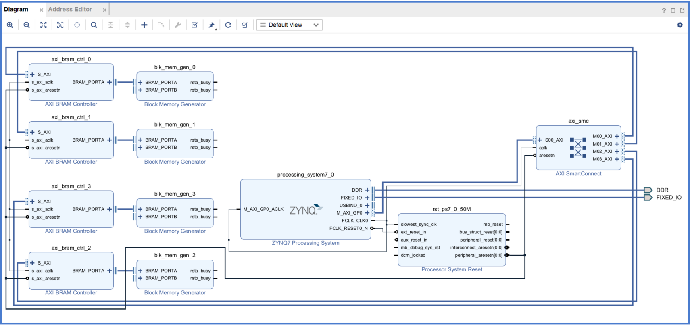
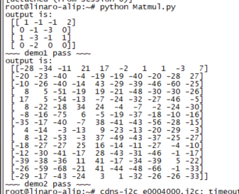

# 实验说明

本次实验对实验板上的BRAM进行了读写测试。

# 实验目标

- 使用Vivado，利用Block Design生成IP核，对开发版的BRAM实现挂载
- 利用python中的内存映射函数，实现对BRAM的读写

# 实验原理

## BRAM

BRAM即Block-RAM, 是 FPGA的固有硬件资源。另一种形式的 RAM 是分布RAM(Distribution RAM)，是由 FPGA 逻辑资源查找表 LUT 拼起来的。

这两种RAM最本质的区别是BRAM默认输入有寄存器，所以它在读、写使能信号后的下个时钟边沿返回数据，而分布式RAM就没有，就是个组合逻辑，读、写使能的同一时刻返回数据。从时序的角度上来说，块RAM更好，唯一不足的是，它是珍贵的硬件资源。一般来说,芯片越高级，块RAM资源越多。

同步双端口BRAM方便通过一个端口写的同时可以从另一个端口进行读取。

## 内存映射

python是无法直接对BRAM进行读写的，其相应的地址区域并不在可以直接读写的地址段中。但是，Linux中的一个重要思想是“一切皆文件”，BRAM也被映射为一个文件，其相应的路径为`/dev/mem`。

基于此特性，可以使用python中的`mmap.mmap()`函数将文件映射到一段内存，通过对内存的读写实现对相应BRAM的读写。

```python
# 将文件映射到内存中，以像访问内存一样访问文件的内容
def _mapping(self, path):
    # 将路径打开为文件描述符
    # 权限控制，表示 只读 | 文件写后即同步
    self.file = os.open(path, os.O_RDWR | os.O_SYNC)

    # 建立内存映射关系
    block_map = {}
    for name, info in self.block_info.items():
        # 使用mmap.mmap创建一个内存映射对象
        block_map[name] = mmap.mmap(
            self.file,    # 打开的文件的文件描述符
            info['size'], # 块大小
            flags=mmap.MAP_SHARED,  # 创建一个可共享的内存映射
            prot=mmap.PROT_READ | mmap.PROT_WRITE,  # 映射区域的保护权限是可读可写
            offset=info['address']  # 块在文件中的偏移地址
        )
    return block_map

self.block_map = self._mapping('/dev/mem')
```

这个函数仅使用过一次，其作用就是创建一个BRAM的内存映射对象，实现对BRAM的读写。

## PL的计算

PL的计算起始与OS中的通信IPC类似，遵循着：利用flag作为握手信号-接受数据-计算-发送数据的流程，需要在开发板上的ARM侧和FPGA侧均对握手信号进行监控，以实现及时开展计算和数据传输。

FPGA测的数据单元是数据被动的，即只能进行计算，不能进行主动的数据传输，需要等待ARM测将数据发送完成后，将flag置1，FPGA测才能开始计算。计算完成后，也需要等待FPGA测主动将数据搬回，除此以外同时无法进行其他的操作。

这实际上是与进程间通信的IPC实现逻辑一致的，使用内存作为消息传递单元，flag作为了传递的最简消息（握手信号），以实现相应的计算开展。看似实际的顺畅通信实际上利用了封装函数接口后的轮询，遮掩了FPGA计算的复杂度。

# 实验实现

## bit流的生成

根据实验指导书进行设计。使用了Vivado提供的Block Design，基于图形化的方式进行了IP核的组合。



## BRAM的基础函数封装

本次实验的一个显著特点就是：BRAM的地址分配实际上是固定的，即只能进行矩阵乘计算。

基于此，可以将BRAM的地址段分为四段：

- 输入矩阵，其大小为M*N
- 权重矩阵，其大小为N*P
- 输出矩阵，其大小为M*P
- 计算指令，包含了flag和实际计算指令的instr

这里分了4段，实际的硬件也是如此，创建了4个BRAM。

在每一段内，利用偏移量实现计算的读写。

同时，BRAM是小端序的，在设计指令时需要进行指定。

```python
# 用于存储需要计算的信息
# 若块内偏移量无特殊含义，则约定key为default，值为0，可根据实际需求修改
block_info = {
    # 输入的矩阵数据 M*N
    'input': _construct_block_info(
        address=0x40000000,
        size=32*1024,   # 32KB
        **{'default': 0x0}
    ),

    # 权重矩阵 N*P
    'weight': _construct_block_info(
        address=0x40020000,
        size=128*1024,  # 128KB
        **{'default': 0x0}
    ),

    # 输出
    'output': _construct_block_info(
        address=0x40040000,
        size=32*1024,   # 32KB
        **{'default': 0x0}
    ),

    # 存储标记和指令，对应偏移量名称为 flag，instr
    # 63:48       47:32             31:16       15：0
    # null        inputN/weightN    weightP     inputM
    # flag用于PS，PL交互
    # 从块头部开始存储，instr从偏移0x10字节的位置开始存储
    'ir': _construct_block_info(
        address=0x40060000,
        size=4*1024,    # 4KB
        **{'flag': 0x0, 'instr': 0x10}
    )
}
```

### 读BRAM指令

读BRAM需要遵循以下的流程：

1. 确定需要读取的段
2. 确定需要读的数据在段中的偏移量
3. 读len个数据
4. 将数据重整为所需要的数据类型、格式

### 写BRAM指令

写BRAM需要遵循以下的流程：

1. 将数据重整为BRAM支持的基本一维数组格式
2. 确定需要读取的段
3. 确定需要读的数据在段中的偏移量
4. 以写内存的方式将数据通过内存映射写到BRAM中

## Matmul计算

Matmul封装了底层硬件计算的复杂性，实现了在顶层通过输入两个矩阵，即可实现相应的计算。

计算的简单流程是：

1. 接受上层python给出的数据，对数据进行padding，以支持硬件计算
2. 传输数据、计算指令到FPGA侧
3. 轮询等待计算完成
4. 传输计算完成的数据，返回上层python接口

### 数据传输

使用了`send_data()`实现了封装。

值得注意的是，输入的计算矩阵和权重矩阵的padding、传输方向并不相同，而是需要对计算举证进行转置。在转置后，才可以进行统一的padding、传输操作。

需要填充的原因是硬件需要分块进行计算，无法处理不对其的情况。

假设两个矩阵分别是`(m,n),(n,p)`,，m和p的维度需要补全至`self.systolic_size`的倍数，并且写入时需要按照补零的方向写入，例如：

1. 矩阵(m, n)是m补零，则m个m个写入BRAM中。（行方向补零，列方向写入）

2. 矩阵(n, p)是p补零，则p个p个写入BRAM中。（列方向补零，行方向写入）

```python
def send_data(self, data, block_name, offset='default'):
    if block_name == 'input':
        # 转置：写入时需要按照补零的方向写入
        data = data.T
        data = self._zero_padding(data)
        self.bram.write(data, block_name=block_name, offset=offset)
def _zero_padding(self, data):
    if data.shape[1] % self.systolic_size != 0:
        row = data.shape[0]
        col = self.systolic_size - data.shape[1] % self.systolic_size
        data = np.hstack((data, np.zeros((row, col), dtype=data.dtype)))
    return data
```

### 指令传输

即基本的位运算，但是python的语法特性需要注意其中的无符号问题，并且FPGA上的数据是小端序的。

```python
def send_instr(self, m, p, n):
    # 63:48       47:32             31:16       15：0
    # null        inputN/weightN    weightP     inputM
    ir = 0
    # inputN/weightN
    ir <<= 16
    ir += n
    # weightP
    ir <<= 16
    ir += p
    # inputM
    ir <<= 16
    ir += m
    # 使用小端序
    instr = ir.to_bytes(8, byteorder='little', signed=False)
    print(f"[instr]:\t{instr}")
    self.bram.write(instr, block_name='ir', offset='instr')
```

### 握手信号

在传送握手信号后，需要进行轮询，等待FPGA侧完成计算。对于轮询，使用基本的while即可，读flag不为0则继续等待，直至完成计算，FPGA侧将flag置为1。

```python
# 写入flag信息
def send_flag(self):
    '''发送flag=1信号'''
    # 左侧是地址地位
    flag = b"\x01\x00\x00\x00"
    self.bram.write(flag, 'ir', offset='flag')

# 读取flag信息
def read_flag(self):
    '''读取flag信号'''
    flag = self.bram.read(1, block_name='ir', offset='flag')[0]
    return flag

def wait_flag(self):
    '''等待flag=1信号'''
    value = 1
    while value != 0:
    	value = self.read_flag()
```

### 接受结果

读大量的数据和读一位的flag并没有本质差别，区别仅在于之后的数据重整，需要重整为支持的数据类型。

```python
def recv_output(self, output_shape: tuple):
    row, col = output_shape
    output_arr = self.bram.read(len=row * col * 4,
                                block_name='output',
                                dtype=np.int32).reshape(row, col)
    print(f"output is:\n {output_arr}")
    return output_arr
```

注意的是BRAM接口中的写长度单位是字节，这里需要进行相应的转换。

# 实验结果与分析

由于只需要完成计算，故完成了计算，其余没有什么指的分析的。



# 实验总结

实现了良好的矩阵乘效果。但是使用PL进行模拟的，这不好，下一次Lab用实际的硬件代替，这很好。