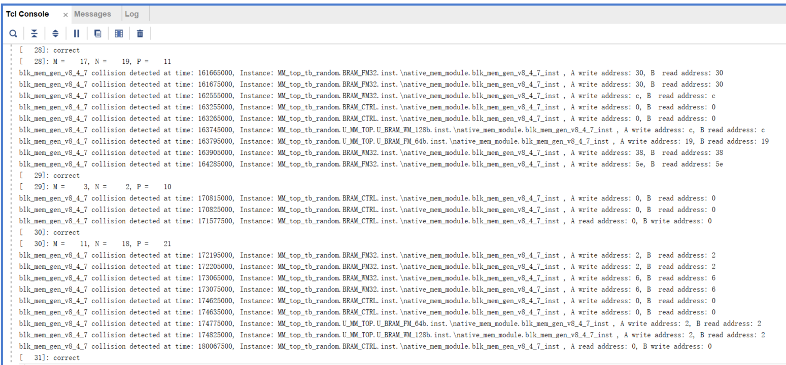
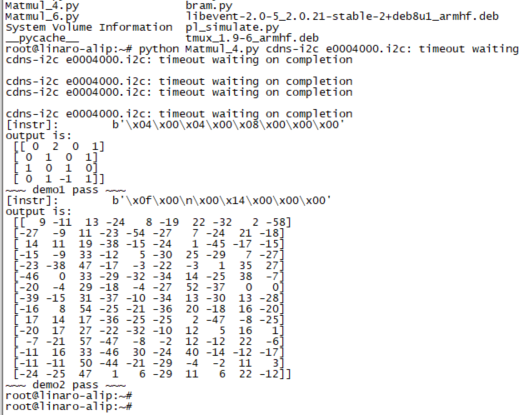
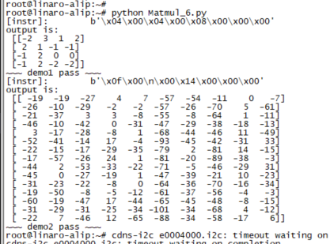
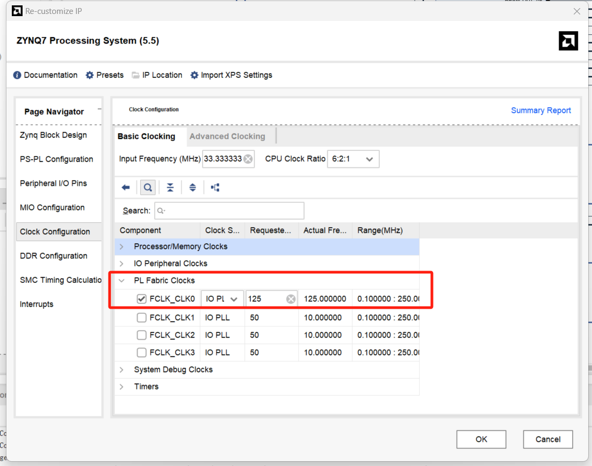
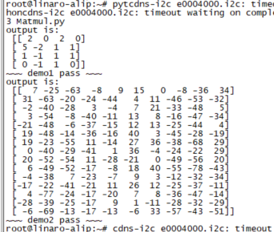

# 实验说明

本次实验在Lab4的基础上，去除了对PL的模拟，改为了使用真实的PL进行实验实现，达成使用硬件完成矩阵乘法的目的。

# 实验目标

- 联合板上的PL和PS侧，使用硬件实现高效的矩阵乘法
- 基于原先的乘法单元MAC，补齐各种操作，实现有序的乘法功能

# 实验原理

以前历次实验的大融合，实现了一个NaiveTPU。

尽管Naive，但是这个TPU能实现在硬件上利用BRAM为存储介质实现矩阵乘法运算，是了不起的。

在硬件上实现的小优化，都是对软件运行速度的巨大提升。

# 实验实现

## 问题一

按照工程中的设置，BRAM_FM64的输入端口限制为$64 * 4096$，BRAM_WM128的输入端口限制为$128 * 8192$，转换为实际存储参数uint8的数量，即为：

- $M * N \le 8 * 4096 = 32768$
- $N * P \le 16 * 8192 = 131072$

当M为8字对齐，P为16字对齐时，可以进行取等。

## 问题二

是足够的

对于硬件而言，其并不关心具体存储的神经网络究竟是哪一个，只关心BRAM中能否放下相应的参数矩阵。

在本实验中，神经网络输入的最大规模为：

| 参数    | MLP        | LeNet     |
| ------- | ---------- | --------- |
| Feature | (1, 784)   | (784, 25) |
| Weight  | (784, 100) | 400, 120  |

因此，对于Feature和Weight而言，输入的最大uint8参数数量为：

- $Feature_{max} = 784 * 25 = 19600$
- $Weight_{max} = 784 * 100 = 78400$

对于存储Feature的BRAM_FM32，其最大可以存储$8 * 8192 = 65536 \ge 19600$

对于存储Weight的BRAM_WM32，其最大可以存储$8 * 32768 = 262144 \ge 78400$

因而均是足够的

## 问题三

实现覆盖率更强、更为自动化的随机测试

### 思路概述

修改TB主要分为以下几个部分：

1. 删除原先从文件中读取参数的方法
2. 在initial块中进行随机化，并重复进行测试

修改TB为工程文件中的`MM_top_tb_random.v`。在此简要描述一下修改的思路：

1. 删去原先从文件中读取数据的方式，改为由`$random`进行生成
1. 修改数据的产生方式：原先的数据逻辑为进行两轮test，分别使用testcase1和testcase2中的数据进行测试。现在修改所有参数均为随机生成，且进行多轮测试
1. 修改控制信号的控制逻辑：原先的控制只进行两轮，现在进行多轮测试。只要达到`c_state==IDLE`状态，即可进行下一轮新的测试
1. 在完成后，进行结果比对，结果正确则进行下一轮，否则使用仿真的系统函数`$finish`结束仿真

### 实验思路

#### 逻辑控制部分

主要修改了状态转移部分，使得在相应状态后进行数据赋值、结果检验等操作。

为了进行数据赋值操作，新设立了feature和weight两个变量，用于保存生成的值。

同时，基于原有的控制信号，在每次检验到`c_state_f3 == READ_OUT`后，说明乘法器输出了一个数据，对数据进行保存：

```verilog
// 记录计算结果
always @(posedge arm_clk) begin
  if (c_state_f3 == READ_OUT) begin
    result_sim[result_cnt] = arm_BRAM_OUT_douta;
    //$display("[%d]: %d", result_cnt, result_sim[result_cnt]);
    result_cnt = result_cnt + 1;
  end
end
```

基于此，可以将数据进行保存，在后续对数据进行检验。

#### 数据生成逻辑

利用`$random`生成逻辑，同时对边界值进行一定的处理。Feature和Weight的生成思路是一致的，这里简单摘取Feature的生成逻辑：

```verilog
{FM_reg0, FM_reg1, FM_reg2, FM_reg3} = $random;
// 处理边界情况
if(i + 1 >= M) begin
    FM_reg1 = 0;
    FM_reg2 = 0;
    FM_reg3 = 0;
end 
else if(i + 2 >= M) begin
    FM_reg2 = 0;
    FM_reg3 = 0;
end 
else if(i + 2 >= M) begin
    FM_reg3 = 0;
end

// 记录生成值
feature[i  ][j] = FM_reg0;
feature[i+1][j] = FM_reg1;
feature[i+2][j] = FM_reg2;
feature[i+3][j] = FM_reg3;
```

值得注意的是，这里对边境情况进行了清零处理。

#### 结果检验

检验的逻辑很简单，在计算完成，即`c_state == FINISH`且生成了`M*P`个数据后，按照矩阵乘法的定义进行检验：

```verilog
for(i = 0; i < M; i = i + 1) begin
    for(j = 0; j < P; j = j + 1) begin
        result_std = 'b0;
        for(k = 0; k < N; k = k + 1) begin
            result_std = result_std + $signed(weight[k][j]) * $signed({8'b0, feature[i][k]});
        end
        if(result_sim[i*P+j] != result_std) begin
            error_flag = 1'b1;
        end
    end
end
```

在`error_flag`为真，即出错时，使用系统函数`$finish`，直接退出仿真，减少不必要的损耗。

### 实验效果

达到的效果截图：

TCL-Console截图为：



仿真波形截图为：


## 问题四

### 工程文件的修改

工程文件的修改主要在于`Multiply_ctrl`中，对获取数据的方式进行了修改，由原先的

### Matmul中的修改

PS侧的数据直接写到BRAM_FM_32b和BRAM_WM_32b中，与原先统一写到BRAM_32中的方式不同，故补0方式也不同。

和原先的相比，主要修改了`_zero_padding`中对补0的步长

将原先的统一补0为`uint8`形式调整为了：

- 当为Feature矩阵时，按照步长为8进行补0
- 当为Weight矩阵时，按照步长为16进行补0

这实际上也是根据矩阵分块的性质进行的调整

### 运行结果

可以看到如下的结果，说明计算结果正确：



## 问题五

补零是不必要的。原因分析见下。

### 原因

即使不补充，在PL侧的数据搬运过程中也会填充相应的0数据，以达到矩阵粉块的作用。

在PL侧的补0操作并不是根据BRAM中的已有数据决定的，而是根据矩阵的参数MNP决定的，故补充什么数据在PL侧看来是不重要的，在**模拟PL**侧看起来是重要的。

### PL侧补0的操作

PL侧补0的操作涉及到了Feature矩阵和Weight矩阵，由于BRAM的大小不同，故补0的操作也不同。

对于Feature矩阵：

```verilog
// 对BRAM_FM64写入的数据
always @(posedge clk or posedge rst) begin
    else if (c_state == WORK) begin
        // 数据拼接，同时达到了补0的效果
        // 进行数据拼接，将32位数据合成64位数据
        // 先写入低位
        if (cycle1_cnt[0] == 1'b0)
            BRAM_FM64_wrdata <= {32'b0, BRAM_FM32_rddata};
        // 再写入高位
        else
            BRAM_FM64_wrdata <= {BRAM_FM32_rddata, BRAM_FM64_wrdata[31:0]};
    end
end

// 对BRAM_WM128写入的数据
always @(posedge clk or posedge rst) begin
    else if (c_state == WORK) begin
        // 数据拼接，同时达到了补0的效果
        case(cycle1_cnt[1:0])
            2'b00: BRAM_WM128_wrdata <= {96'b0, BRAM_WM32_rddata};
            2'b01: BRAM_WM128_wrdata <= {64'b0, BRAM_WM32_rddata, BRAM_WM128_wrdata[31:0]};
            2'b10: BRAM_WM128_wrdata <= {32'b0, BRAM_WM32_rddata, BRAM_WM128_wrdata[63:0]};
            2'b11: BRAM_WM128_wrdata <= {BRAM_WM32_rddata, BRAM_WM128_wrdata[95:0]};
            default: BRAM_WM128_wrdata <= BRAM_WM128_wrdata;
        endcase
    end
end
```

这里的补0操作利用了数据写入的时间先后顺序，实现对数据的补充。

## 问题六

### MAtmul中的修改

由于进行了跳写，故可以不用对原始数据进行padding操作，而是直接在对应偏移量处直接写入数据。

核心在于每次对BRAM写入一行的数据，把所有的行进行写入。

```py
n, p = data.shape
p = p if p % self.systolic_size == 0 else (p // self.systolic_size + 1) * self.systolic_size

# C语言风格的内存布局：行优先
data = data.copy(order='C')

for i in range(n):
    self.bram.write(data[i], block_name=block_name, offset=i * p)
```

同时，需要注意对不满一行数据的特殊处理，并将数据按照行优先的方式进行排列。

### BRAM中的修改

为了支持直接在offset处进行写操作，对`bram.py`文件中封装的`wrtie`函数进行修改，使得能够直接写对应offset处的数据。

```py
mem_offset = self.block_info[block_name]['offset'][offset] if isinstance(offset, str) else offset
```

### 结果

结果为：



## 问题七

频率为125MHz

FPGA侧即为PL侧，故可以查看PL中的相应时钟频率。



## 问题八

### 状态转移图

首先需要明确各个状态的定义，参考指导书给以给出为：

| 名称   | 含义                                                         |
| ------ | ------------------------------------------------------------ |
| IDLE   | 初始状态                                                     |
| INFO   | 传递参数，项对齐结果的fifo传递需要对齐的矩阵参数             |
| WORK   | 进行计算，本质是在向乘法器中搬运数据                         |
| WAIT   | 搬运数据完成后，乘法器会自动向对齐fifo传递数据，等待对齐完成 |
| FINISH | 完成所有计算                                                 |

可以得到状态转移图：


### 寄存器功能

由于有两个乘法器进行运算，而只有一个控制器，所以需要两套参数来记录每个乘法器进行运算的参数信息。

第一套参数：记录在图中左侧乘法器和align-fifo所需要的参数

- `sub_scale_M1`：子矩阵1的M
- `sub_scale_P1`：子矩阵1的P

第二套参数：记录在图中右侧乘法器和align-fifo所需要的参数

- `sub_scale_M2`：子矩阵2的M
- `sub_scale_P2`：子矩阵2的P

对于M而言，其含义是结果矩阵的行数，而在乘法器中矩阵按行方向送入，故M代表了送入每个运算器、fifo寄存器的数据量，也可以说是循环数。有`sub_scale_M1 = sub_scale_M2`

对于P而言，其含义是结果矩阵的列数，对于两个乘法器而言是不一样的，上限为8，故计算为：

```verilog
// 对齐M次
sub_scale_M1 <= sub_M;
sub_scale_M2 <= sub_M;
// 需要的对齐单元数，要考虑是否需要两个单元
sub_scale_P1 <= (sub_P > 'd8)? 'd8: sub_P;
sub_scale_P2 <= (sub_P > 'd8)? (sub_P - 'd8): 'd0;
```

## 问题九

下面将简单介绍IP单元、对齐流程、写过程和读过程。

### IP单元

Aliogn-fifo使用了IP单元`U_out_align_fifo`作为基本的Fifo单元，共有8个。

对于Fifo单元，其各接口的含义为：

```verilog
out_align_fifo U_out_align_fifo(
    .clk   (clk),
    // 写使能
    .wr_en (fifo_wr_en[i]),
    // 读使能：对fifo中的数据依次读出
    .rd_en (fifo_rd_en[i]),
    // 输入数据
    .din   (fifo_data_in[i]),
    // 输出数据
    .dout  (fifo_data_out[i]),
    // fifo是否满，空置
    .full  (),
    // fifo是否为空
    .empty (fifo_empty[i])
);
```

由于Fifo采用了先进先出的设计，故读使能还具有将数据送出的作用，这点比较独特

### 对齐流程

对齐流程实际上就是：

1. 对于8个Fifo，依次读入数据，直到均读满数据
2. 当8个Fifo均读满数据后，说明已经存入了全部的数据，由于之前没有送出数据，故已经有了对齐效果
3. 将数据送出，达成对齐效果

波形图为：


### 写过程

对于每一个Fifo，均有单独的写使能和数据输入进行控制。

当外部输入有效且**数据没有达到上限**时，即可进行读入。

```verilog
// 写使能
assign fifo_wr_en[0] = (~align_fifo_get_all) && valid_get0 && (sub_scale_P > 8'd0) && (fifo_wr_cnt[0] < sub_scale_M);
```

同时，之前的`Multiply_ctrl`单元发送了结果矩阵的参数M、P，在写入数据过程中也会记录写入的数据数量没有超过限制。

### 读过程

Align-Fifo只有一个对外的输出，如何依次输出所有的数据：读过程是基于乘法器的数据输出特点，利用状态机实现的，每周期输出一个数据，依次从第一行输出到第八行。

对于状态机，即为简单的NOW_OUT0~NOW_OUT7，每周期转移至下一个数据列，同时也会检查相应的结果矩阵参数。

```verilog
case (c_state)
    NOW_OUT0: begin
        fifo_rd_en[0] = (~fifo_empty[0]) & out_ctrl_ready;
        valid = fifo_rd_en[0];
        data = fifo_data_out[0];
    end
endcase
```

利用状态机的特性，给予读使能和读数据选择，从而实现了有序输出。

## 问题十

以下介绍问题和实现思路，具体的工程文件见`question10`文件夹。

### 削减 MAC 资源

实现见文件。

#### 问题

原先的MAC设计存在大量的冗余控制信号：

- 对于MAC之间的横向数据和纵向数据传递，分别使用了`w_valid`和`f_valid`信号
- 全局有一个`num_valid`和`rst`信号

由于MAC固定的计算节奏，这样的控制信号设计是冗余没有必要的，可以进行删除代替。

#### 实现

由于MAC的数据传递固定为每个计算结点向右向下传递数据，故实际计算中的信号只需要确定计算的开始和结束，MAC单元会自动负责计算的进行。

并且，由于MAC中设计有了计算器，实际上每个MAC是清除自身的行为逻辑的，不需要额外的外部信号进行驱动，可以只使用一个外u开始有效信号`num_valid`信号完成对于数据有效的控制，其效果为：

1. 重置MAC内部寄存器，设置`num_r`寄存器为输入的`num_r`值
2. 当输入数据有效时，拉低num_valid信号，乘加器自动开始计数，在指定周期内完成乘法的运算要求

可以将整个矩阵乘法器与外部对接的`num_valid`信号接入左上角的第一个乘加模块，后续模块的`num_valid`信号接入左侧或者上方乘加模块的`num_valid_r`输出。

由于MAC进行了大量的重复使用，简单的优化都可以带来较好的资源提升效果。

### 输入输出对齐优化

实现见文件。

#### 问题

尽管输入输出并不涉及计算时序，但是输入输出的数据搬运时序严重约束了操作。

且当前使用FIFO的设计有如下问题：为了使用IP核，造成了资源冗余，如使用的`U_out_align_fifo`，其中为了满足IP的使用约束有大量无意义的操作，如诡异的控制逻辑，大量冗余的控制信号。

实际上这样的操作是没有必要的，有如下几个原因：

1. 实际上乘法模块的输出顺序是确定的，不存在中间结果的阻塞。确定的时许关系不需要冗余的握手信号
2. 乘法器的数据输入宽度有限，最宽为8，完全可以替换为8列的寄存器序列，使用寄存器的时序效果进行对齐
3. 由于输入的特性，可以较快完成输入，没必要使用完整的FIFO

#### 实现

使用SystemVerilog实现了一个`my_fifo.sv`，使用寄存器队列代替原先的IP效果，实现了对数据的对齐。

对于输入：

- 后一列/行的数据要求输入滞后前一列/樊的数据一个周期，因此对于每后一列，都可以加上一个寄存器，达到延缓的效果。
- 按照这种方式给每一列的数据输入加上不同级数的寄存器，就完成了数据的align操作，并不需要单独的fifo实现。

这样实现的对齐模块，可以有效的降低设计复杂度和资源占用情况，不再需要额外的Align-Fifo的IP，且易于实现参数化。

### 参数化

#### 问题

当前的设计限制了输入矩阵最多为`8*N, N*8`，尽管使用了矩阵分块操作，但很可能还是不够用的。如进行浮点乘需要16位。为了解决此问题，可以使用语法中的参数功能进行优化，破除原先的固定大小。

当然，这样实现也是有限制的，如BRAM的地址空间约束等等。

由于实现此优化几乎无法用Verilog语言完成，需要使用SystemVerilog或Chisel等语言完成，需要重写整NativeTPU，由于相应的DDL的时间约束，这里仅提出方案思考，并没有实际解决。

#### 实现

方案为：

1. 使用SystemVerilog进行一定重写：这两个语言绝大部分是相同的，SystemVerilog在Verilog基础上进行了一定的扩展，重写的额外花费是不大的
2. 对数据的输入宽度、数据总线的传递进行参数化，使得其能支持`*parameter int* NUM_WIDTH = 8`形式的模块参数化
3. 对顶层的Vivado工程进行一定的修改，是得支持更大的BRAM地址空间，支持更灵活的数据操作

# 实验结果与分析

取得了较好的实验效果。

可以使用硬件实现矩阵乘法：



# 实验总结

使用硬件实现了良好的矩阵乘效果，将之前历次实验的结果进行了融合，达到了较好的效果。

在硬件上能实现的操作，都是对性能的巨大提升！