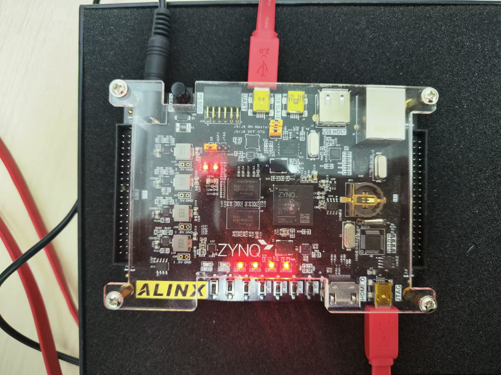

# 实验说明

本次实验在Lab5的实现的NativeTPU基础上，使用TPU代替传统的乘运算，实现了高效的简单神经网络推理。

本次实验实现了指导书中的全部附加题，并提出了一种具有良好优化效果的优化方案。

# 实验目标

- 使用之前实验实现的NativeTPU，实现在FPGA上的推理运算
- 对多种不同的优化方式进行分析，找出实际有用的优化方式
- 结合FPGA的特性，分析优化瓶颈

# 实验原理

基于原先实验实现的NaiveTPU，在FPGA上实现了神经网络的推理，能够正常运行LeNet和MLP，且对运算有一定的加速效果。

## FPGA的矩阵乘优化效果

FPGA的加速效果主要为**加速矩阵乘运算**，即使用之前实现的NativeTPU，用TPU的矩阵乘效果代替Zynq本身的矩阵乘代替在CPU的矩阵乘。

具体的实现为：在相应的算子中识别矩阵乘操作，用封装的`Matmul`方法替代了原先的`np.matmul`，这样在进行神经网络的推理过程中，就可以实现较好的推理加速效果。

例如，在进行卷积操作时，就会使用TPU提供的Matmul方法来实现输入矩阵和权重矩阵的 相乘：

```python
if isinstance(self.matmul, Matmul):
    x = x.astype(np.uint8)
y = self.matmul(x, w)
```

## LeNet的推导原理

LeNet是一个经典的卷积神经网络(CNN)架构，主要用于手写数字识别任务。从代码实现来看，整个网络包含以下几个关键层次：

### 第一个卷积块

第一个卷积块使用了一个卷积层和一个池化层来进行实现

- 卷积层包含6个5x5的卷积核，输入通道为1，并使用SAME的padding方式来保持特征图大小，用于提取基础特征
- 池化层中使用2x2最大池化，用于降维压缩，提高特征不变性

### 第二个卷积块

第二个卷积块使用了一个卷积层和一个池化层来进行实现

- 卷积层包含16个5x5的卷积核，输入通道为6，并使用VALID的padding方式来保持特征图大小，组合低层特征，形成更复杂的特征模式
- 池化层中依然使用2x2最大池化，用于进一步降维，增强模型鲁棒性

### 展平层

展平层用于将卷积特征图转换为一维向量，便于全连接层处理

### 全连接层

全连接层中共有三个全连接层，其作用分别为：

- Dense3: 将特征映射到高维空间
- Dense4: 进一步特征转换
- Dense5: 最终分类层，输出10个类别的概率分布

## MLP的原理

实验中的MLP为两个全连接层，用于检验TPU的效果。

全连接层的核心数学公式为：$Y = WX + b$，可以有效检验TPU的矩阵乘时候有效。

# 实验实现

本次实验较为简单，只需要跟随指导书进行相应的实现即可。

## 运行时间方案对比

以下为实验数据的记录表格，记录了在FPGA上的平均运行时间，单位为s：

| model | np.matmul | matmul | 地址跳写 | 数据总线 |
| ----- | --------- | ------ | -------- | -------- |
| lenet | 0.0262    | 0.0225 | 0.1429   | 0.0174   |
| mlp   | 0.0097    | 0.0071 | 0.1224   | 0.0041   |

其中：

- `np.matmul`表示在ARM上使用Numpy进行矩阵乘法，执行神经网络
- `matmul`表示在FPGA上执行矩阵乘法，执行生姜网络
- 地址跳写表示在ARM采用跳地址方式进行存储，对BRAM进行写入
- 数据总线表示当位宽为64bit或128bit时的FPGA侧矩阵乘法运算

具体的运行时间截图如下：

LeNet的运行时间：（从左到右与表格的顺序一致）


MLP的运行时间：（从左到右与表格的顺序一致）


## 基本问题分析

对比使用`np.matmul`和使用`matmul`的运行时间，可以得出结论：使用TPU进行计算具有一定的优化效果，但效果并不是十分显著。

分析LeNet使用的数据可以发现，所进行乘的矩阵大小基本在20\*20左右，在进行矩阵运算时，会涉及到矩阵分块和频繁的数据搬运操作。在运行主频较低的FPGA上，频繁的数据搬运会成为运行的瓶颈之一。

综上，可以得到对运行时间的比对分析：

- 硬件加速：TPU的矩阵乘具有良好的加速效果，可以同时执行多个操作，这使得FPGA在执行矩阵乘法等并行度高的操作时具有天然优势。
- 数据搬运开销：FPGA进行矩阵乘需要频繁在FPGA侧和ARM侧进行数据搬运，较低的时钟频率使得数据搬运的时间花销较大，与TPU带来的加速效果相抵，使得加速效果不明显

## 附加题：跳地址

在使用跳地址后，反而出现了较为明显的**负优化**，猜测结果为：跳地址过程中对数据的写为每次写一个字节，会频繁地开启BRAM，在ARM侧和FPGA侧进行频繁的数据搬运带来了巨大的时间花销。

而原先的写数据方式只需要向BRAM中发送一次数据搬运请求，可以减少数据搬运开启的时间花销，降低了不必要的损耗。

```python
# 一次只搬运一个数据带来了巨量花销
data = data.copy(order='C')
for i in range(n):
    self.bram.write(data[i], block_name=block_name, offset=i * p)
```

因为这个原因，使得FPGA的加速效果被抵消，反而取得了交叉的运行时间。

## 附加题：总线位宽

在改变总线位宽后，取得了较为显著的运行时间提升。

合理猜测原因为：数据总线的宽度提升让一次能够搬运更多的数据，节省了数据搬运的时间，让TPU的加速效果有了较为显著的提升。

## 附加题：能否继续提升

答案是：能。

当前的运行瓶颈依然在数据搬运过程，需要频繁地在FPGA侧和ARM侧进行数据搬运，有效的解决方案就是缓解这样的数据搬运花销。

可行的解决方案如下：

1. 提高FPGA侧的主频，提高数据搬运速度，减少数据搬运带来的损耗
2. 使用乒乓模式：
   1. 当前若要进行一次矩阵乘法，就需要从cpu向矩阵乘法加速器的buffer搬运一次数据，并搬回一次，这个过程是完全串行的
   2. 可以进行一定的时间压缩，如设置不同的buffer区域，使得乘法器在运算的同时，cpu可以准备下一次运算的数据
   3. 即提升为乒乓模式。让任务在一定程度上并行，提高模块的整体吞吐量和效率
3. 使用DMA：
   1. 当前的加速模块，使用AXI-GP与PS侧通讯。但是AXI-GP的通讯效率较低，cpu将数据写入到AXI-GP需要绕过内部的Cache，写入效率也并不高。
   2. ZYNQ实现上，为其ARM核加入了一个AXI-ACP接口，该接口直连CPU核的SCU，拥有高性能以及与CPU核心的缓存一致性。
   3. 如果在PL侧实现一个DMA，通过配置寄存器指定内存中数据的地址，由DMA将对应数据直接搬运到PL侧的bram，计算完成后再搬运回去。这样实现可以大幅度的提高PL与PS侧的通讯性能，且尽可能的使用片上的l2 cache提高性能，尽量不使io变成系统的性能瓶颈。

# 实验结果与分析

综合上述实验可以得到结果：

1. TPU确实有一定的加速效果，尽管主频较低，但是依然对矩阵乘法有着加速效果
2. 目前的瓶颈在于数据搬运，从FPGA侧到ARM侧往返搬运数据成为了瓶颈所在，需要提高数据搬运的效率

# 实验总结

从一开始的CNN到路径运行在开发板上的NativeTPU，我也实现了一个具有一定优化效果的矩阵乘法，也学习到了如何在FPGA上实现加速模块。

原先我不知道怎么调度CPU之外的模块，以为离不开编译器的帮助，路径，看着矩阵乘的输出，一种喜悦感油然而生：这种体系结构和智能计算的交融，真不错！


