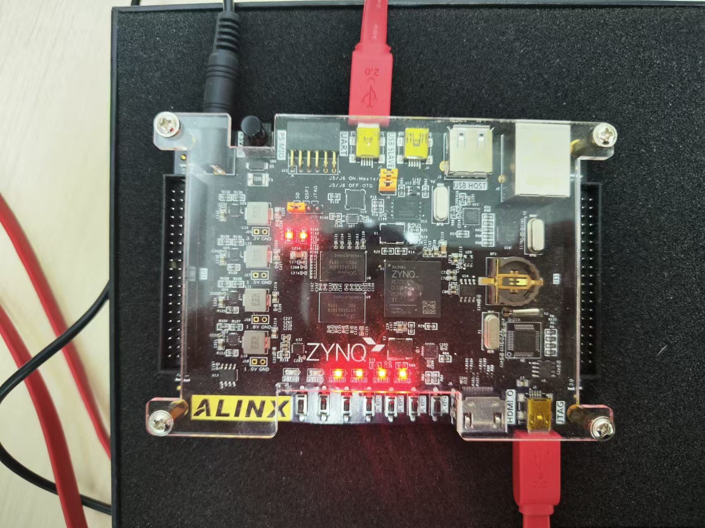

# Intelligent-Computing-Architectures

从Lab1到Lab6，实现了一个NativeTPU，可以在Zynq上实现矩阵乘法加速。

NativeTPU的具体实现可以见Lab5的相关代码，在Lab6中，实现了在开发板上运行LeNet，调用了硬件提供的矩阵乘法加速，具有一定的加速效果。

> 从一开始的CNN到如今运行在开发板上的NativeTPU，我明白了如何使用硬件，即“智能计算体系结构”来实现对“智能计算”的加速，从底层视角支撑上层的加速运算。
>
> 当下是一个大模型井喷的时代，人人渴望从软件的视角进行代码书写，使用AI来进行加速。自顶向下，大模型，LLM-serving，vllm等sys调度优化，os调度优化，到如今实现的体系结构优化。CS的世界从来不是铁板一块，而是带有着紧密串联的全体视角。
>
> 在课程开始之前，我并不知道怎么调度CPU之外的模块，以为离不开地址空间的约定、编译器的帮助，如今看着矩阵乘的输出，一种喜悦感油然而生：自顶向下，自底向上，逻辑的算符在电子中流淌，编制了智能计算的世界。

